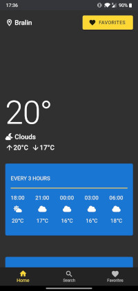
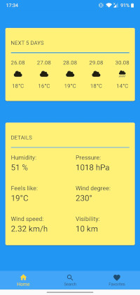
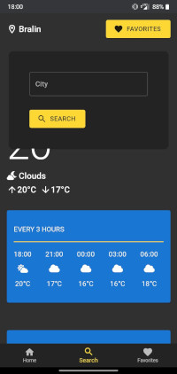

# Nightly Sunny
It is weather website that provides information thanks to openweathermap API. To create this project I mainly used React and Material UI. This page adapts to color theme of website and can be installed as PWA on many devices. To store favorites list after leaving website I applied HTML Web Storage API - localStorage.
  Link to website: https://nightly-sunny.web.app/  
Screenshots from mobile version:  

